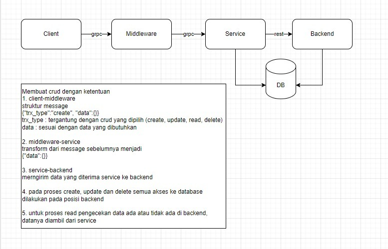

# Ihsan Solution - Assessment Test

<p align="center">
    
</p>

---

## Getting Started

1. Clone the repo

   ```shell
   git clone https://github.com/cndrsdrmn/ihsan-assesment.git
   ```

2. Install dependencies
   
   ```shell
   cd ihsan-assesment
   buf dep update
   go mod tidy
   ```
   
3. Generate protobuf code
   
   ```shell
   buf generate
   ```
   
4. Build binary
   
   ```shell
   make build
   ```

5. Run services
   ```shell
   make run-backend
   make run-service
   make run-middleware
   make run-client
   ```
   
## Tech Stack

- [Go](https://golang.org/) 1.24
- [Buf](https://buf.build/docs/cli/) - Protocol toolchain
- [gRPC](https://grpc.io/) Service Communication
- [Gin](https://gin-gonic.com/) REST API Framework
- [GORM](https://gorm.io/docs/) - ORM with Sqlite
